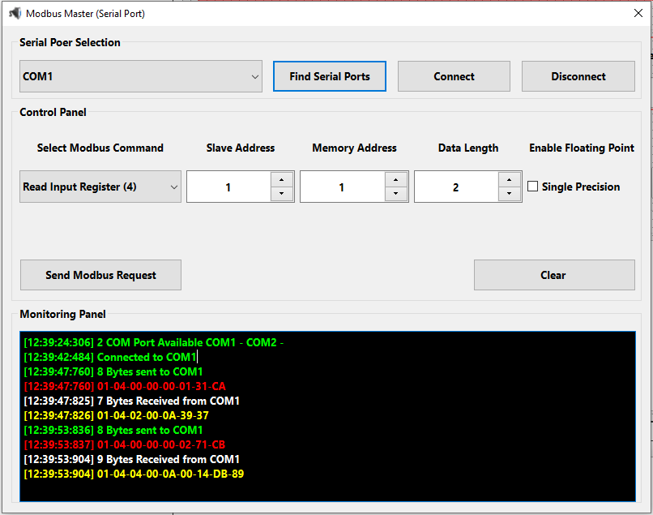
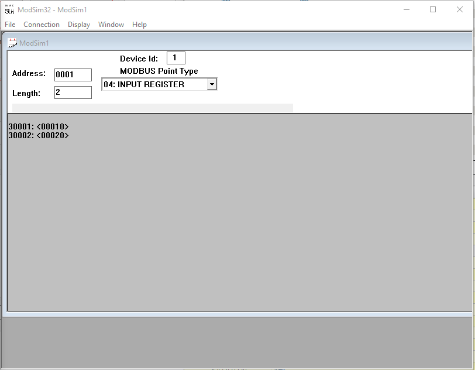

# Modbus Master (QT C++ Windows)
Modbus Master for windows 

  
  

# Project Goals
  - Simple Modbus Master tool for testing Modbus protocol
  - Study communication protocol between Modbus master and Modbus slave
  - Simulate Modbus based water meter communucation and operation
  - handling Modbus implementation challanges without using any real hardware 

# Features
  - Support serila port, Auto find serial ports
  - Support Modbus master request read input registers
  - Support Modbus exceptions

# How to use
  - Build and run on windows 10 using QT creator 6
  - Load and select serial port 
  - Serial port configuration : Baud 9600, Data 8, Parity Even, Stop 1
  - Click Connect to open serial port
  - Configure modbus command parameters 
  - To display flouting point numbers enable floating point
 
